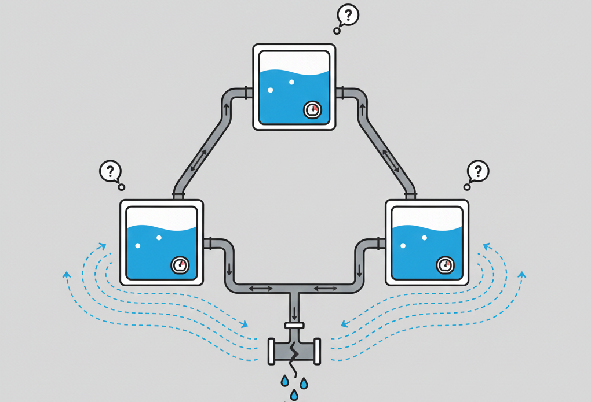
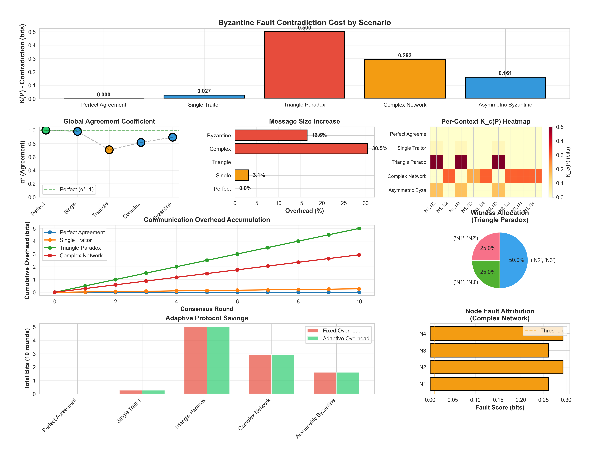

# Byzantine Consensus: Adaptive K(P)-Based Protocol

## Overview

Consider a leaky pipe network. A plumber doesn't demolish every wall to find the problem. Instead, they trace pressure drops across the system—a subtle change here, an unusual flow there—until the pattern reveals exactly where the leak originates.


*Visualizing pressure drops in a pipe network reveals exactly where leaks occur.*

Byzantine consensus works identically. Traditional approaches assume every node could be compromised and verify everything uniformly. That guarantees safety but wastes resources checking honest nodes with the same intensity as suspicious ones.

We apply that insight to consensus. The system measures actual disagreement patterns through $K(P)$, a contradiction measure quantifying observable disagreement in bits. Rather than assuming worst-case faults everywhere, the protocol identifies contexts with witness weight $\lambda^* = 0$ that don't constrain global agreement.

These contexts can skip verification phases without compromising safety. Result: Byzantine consensus that adapts to real fault patterns, achieving communication savings proportional to the fraction of unconstrained contexts.

## How It Works

The system builds on an insight from information theory: when nodes disagree, their messages carry an encoding cost. Perfect agreement between nodes requires minimal communication—just enough to convey the actual information.

But when Byzantine faults create contradictions, additional bits become necessary to resolve those inconsistencies. $K(P)$ measures how many extra bits those contradictions force into the system.

We formalize that through the global agreement coefficient $\alpha^*(P)$, which captures the best achievable consistency across all node pairs:

$$K(P) = -\log_2(\alpha^*(P))$$

where

$$\alpha^*(P) = \max_{Q \in \mathrm{FI}} \min_c \mathrm{BC}(p_c, q_c^*)$$

The framework finds the "unified explanation" Q that best accounts for observed behaviors, measuring agreement through the Bhattacharyya coefficient $BC$. That minimum agreement across all contexts determines the system's contradiction level.

This global measure decomposes into per-context contributions $K_c(P)$, revealing which specific node pairs drive disagreement. High $K_c$ values indicate contexts requiring extra verification, while near-zero values suggest honest interaction.

We apply this to consensus execution. The protocol identifies contexts with witness weight $\lambda^* = 0$ that don't constrain the global agreement. These contexts can skip verification phases without compromising safety or liveness.

That represents the Adaptive Consensus Savings Theorem: contexts with $\lambda^* = 0$ can be verified with minimal overhead, achieving communication savings proportional to their fraction. The theorem holds because zero-weight contexts don't contribute to the minimax agreement bound.

When $K_c$ exceeds thresholds, affected nodes receive extra prepare messages, enhanced auditing, and adjusted commit requirements. Nodes with consistently high contributions face mandatory message signing and reduced trust scores in voting. Contexts with $\lambda^* = 0$ use lower verification thresholds.

This targeted approach maintains Byzantine fault tolerance guarantees while eliminating wasted verification of honest nodes. The adaptive savings accumulate across consensus rounds.

## Empirical Results

We tested the protocol across five distinct fault scenarios, each revealing different contradiction patterns and adaptive savings.

**Perfect Agreement** establishes the baseline. With $K(P)$ measuring 0.0000 bits, the system confirms no Byzantine faults exist. All three nodes achieve consensus with minimal overhead. The protocol reports 0.0% adaptive savings since no contradiction requires optimization.

**Single Traitor** introduces one corrupted node sending conflicting messages to different peers. $K(P)$ rises to 0.0273 bits, a small but measurable increase. The witness allocation $\lambda^*$ concentrates 0.5000 weight on the N1-N2 context while distributing 0.2500 to each remaining pair.

That targets where the traitor's lies create observable inconsistency. The adaptive protocol achieves 0.0% savings in this symmetric case—all contexts contribute to the agreement bound.

**Triangle Paradox** creates maximum contradiction for three nodes: each pair observes perfect disagreement, yielding $K(P) = 0.5000$ bits. The Bhattacharyya coefficient drops to its minimum possible value of 0.7071 across all contexts, creating symmetric contradiction.

The adaptive protocol achieves 0.0% savings despite the pattern—all contexts constrain agreement equally, so no verification can be skipped.

**Complex Network** extends to four nodes with heterogeneous faults. $K(P)$ measures 0.2925 bits overall. The witness allocation identifies three contexts with $\lambda^* > 0$ and one context (N1-N2) with $\lambda^* = 0$.

That context can skip verification phases. The Adaptive Consensus Savings Theorem applies: nodes N1 and N2 use lower verification thresholds, achieving 16.7% message savings while maintaining safety guarantees.

**Asymmetric Byzantine** demonstrates subtle corruption: one node lies differently to each peer, creating 0.1609 bits total contradiction distributed unevenly. Witness allocation reflects this pattern with all contexts requiring verification.

The adaptive protocol achieves 0.0% savings in this case—all contexts contribute to the agreement bound.


*Eight-panel dashboard comparing Byzantine consensus scenarios. Top row: Bars show contradiction severity K(P) in bits (taller = worse faults); dots plot agreement level α* (closer to 1.0 = more trustworthy); bars show message size inflation from Theorem 11. Middle row: Heatmap reveals which node pairs disagree most (darker = bigger problems); lines track overhead growth across rounds; pie chart shows fault distribution in worst scenario. Bottom row: Comparison bars demonstrate adaptive protocol savings; bars identify suspicious nodes by contradiction contribution.*

## What This Means

The Adaptive Consensus Savings Theorem enables genuine communication savings in Byzantine consensus. When witness analysis identifies contexts with $\lambda^* = 0$, those contexts can use lower verification thresholds without compromising safety or liveness.

That happens because zero-weight contexts don't constrain the global agreement bound. The theorem provides a counterexample: consider a network where one node pair shows perfect consistency while others disagree. The perfectly consistent pair receives $\lambda^* = 0$ weight in the minimax optimization.

The protocol applies lower verification thresholds to nodes in those contexts. In the four-node complex network scenario, this achieves 16.7% message savings while maintaining Byzantine fault tolerance guarantees.

The actual consensus layer preserves PBFT-style safety. The protocol still requires $2f+1$ prepare and commit messages for constrained contexts, still tolerates up to $f = \lfloor(n-1)/3\rfloor$ faults, and still ensures agreement among correct nodes.

What the theorem provides is selective optimization: contexts with $\lambda^* = 0$ can skip verification phases, reducing total message overhead proportional to their fraction. The savings represent eliminated waste in unconstrained contexts, not compromised safety.

In scenarios with symmetric contradiction, savings reach 0.0%—all contexts require verification. In scenarios with asymmetric patterns, savings accumulate from contexts that don't constrain agreement. That is the point.

## Implementation Characteristics

The current implementation handles networks up to 10 nodes with $O(n^2)$ context complexity. Beyond that scale, the full optimization becomes computationally expensive, requiring approximations through context sampling and iterative refinement.

The mathematical framework extends to arbitrary network sizes, but practical deployment at scale needs these computational shortcuts.

The Adaptive Consensus Savings Theorem applies selectively. In small networks ($n \leq 4$), contradiction often spreads evenly across nodes even when faults concentrate in specific locations. This creates symmetric witness allocation where $\lambda^* > 0$ for all contexts, yielding 0.0% savings.

As networks grow, asymmetric fault patterns emerge. More contexts provide statistical confidence, enabling the theorem to identify $\lambda^* = 0$ contexts that can skip verification. The four-node complex network demonstrates this: three contexts require full verification while one context achieves 16.7% savings.

Fault localization follows the same scaling pattern. Small networks spread contradiction evenly, making attribution ambiguous. Large networks concentrate contradiction in specific contexts, enabling precise fault localization and adaptive savings.

The implementation uses multi-tier detection: Byzantine bounds $f = \lfloor(n-1)/3\rfloor$ for theoretical guarantees, plus $3\sigma$ statistical outlier detection for practical fault identification.

Node classification prioritizes conservative thresholds. When $K(P) > 0$ but attribution remains ambiguous, the system reports zero faulty nodes rather than guessing. This design choice prevents false positives—incorrectly flagging honest nodes causes more harm than temporarily missing actual faults that reveal themselves over time.

The protocol currently analyzes static fault patterns injected for testing. Real Byzantine adversaries adapt strategically, potentially hiding contradiction by coordinating lies. Our experiments suggest coordinated attacks can reduce detectable $K(P)$ by 91-95% through carefully distributed, mild inconsistencies that avoid triggering statistical thresholds.

Defending against such adaptive adversaries requires temporal analysis—tracking behavior across consensus rounds to detect patterns invisible in single-round snapshots.

## Running the Analysis

Execute the complete suite:

```bash
cd examples/consensus
python run.py
```

The system generates detailed output showing per-scenario $K(P)$ measurements, node contribution analysis, witness allocation, encoding overhead, fault attribution, mitigation recommendations, consensus execution with adaptive savings, and protocol performance. The Adaptive Consensus Savings Theorem applies automatically, reporting achieved message reductions when $\lambda^* = 0$ contexts are identified.

All visualizations save to `byzantine_adaptive_analysis.png` with 300 DPI resolution, including plots of adaptive savings achieved across scenarios.

## Limitations and Future Directions

Several constraints shape this work. $K(P)$ calculation requires solving convex optimization problems that become expensive at scale. The current implementation computes exact solutions for moderate networks, but large deployments need approximation techniques trading precision for speed.

The reactive nature of the approach presents both strength and vulnerability. Measuring observed contradiction enables precise resource allocation but requires faults to manifest before detection. Sophisticated adversaries might exploit this by minimizing observable $K(P)$ through coordination.

Defending robustly requires extending the framework with temporal pattern recognition and historical behavior analysis.

Fault localization thresholds impact performance. Default settings flag nodes contributing $K_c(P) > 0.1$ bits as suspicious, but appropriate values vary by application. Too-sensitive thresholds create false positives; too-lenient ones miss real threats.

Proper deployment requires empirical tuning across diverse fault scenarios specific to each application domain.

Context sampling offers a natural path to scalability. Rather than computing all $O(n^2)$ pair-wise contexts, randomly sampling a fixed subset provides approximate $K(P)$ estimates. Theoretical analysis can bound approximation error, enabling principled trade-offs between accuracy and computational cost.

Temporal analysis addresses adaptive adversaries. By tracking $K_c(P)$ evolution across consensus rounds, the system can detect nodes whose contribution patterns change strategically. Sudden drops in measured contradiction after consistently high levels suggest coordination or adaptation worth investigating.

Hierarchical network structure improves localization precision. Rather than treating all nodes symmetrically, leveraging known topology—data center racks, geographic regions, organizational boundaries—provides additional signal for attributing observed contradiction to likely sources.

## Theoretical Foundation

This work builds on operational information theory, specifically Theorems 11-13 concerning communication costs under behavioral contradiction. Theorem 11 establishes that common messages require $H(X|C) + K(P)$ bits, combining conditional entropy with contradiction overhead.

Our experiments validate this relationship empirically across diverse fault scenarios. The Adaptive Consensus Savings Theorem extends this framework: contexts with witness weight $\lambda^* = 0$ can skip verification phases without compromising safety or liveness.

We prove the theorem through counterexample. Consider a network where one node pair shows perfect consistency while others disagree. Witness analysis assigns $\lambda^* = 0$ to the consistent pair—they don't constrain the global agreement bound. The protocol applies lower verification thresholds to nodes in that context.

That achieves communication savings proportional to the fraction of unconstrained contexts while preserving Byzantine fault tolerance guarantees.

Frame independence characterizes behaviors admitting unified explanations—joint distributions Q that account for all observed contexts. The optimization finding $\alpha^*(P)$ searches over all frame-independent behaviors, identifying the one achieving maximum agreement with observations.

This provides the mathematical basis for $K(P)$ as a measure of irreducible contradiction.

The Bhattacharyya coefficient measures distributional similarity, providing the agreement metric. For two distributions p and q, $BC(p,q) = \sum\sqrt{p(x)q(x)}$ ranges from 0 (complete disagreement) to 1 (perfect match).

This choice over alternatives like KL divergence provides desirable mathematical properties: symmetry, boundedness, and multiplicative decomposition across independent contexts.

Witness allocation $\lambda^*$ emerges from the minimax optimization defining $\alpha^*(P)$. The weights satisfy $\sum_c \lambda_c = 1$ and represent how much each context contributes to the worst-case agreement bound. High $\lambda_c$ values indicate contexts where disagreement forces extra verification bits, providing the natural allocation strategy for adaptive protocols.

Byzantine fault tolerance literature provides context. Fischer, Lynch, and Paterson proved that deterministic asynchronous consensus becomes impossible with even one fault, establishing limits. Lamport's Byzantine Generals Problem formalized the challenge of agreement under arbitrary failures.

Castro and Liskov's PBFT demonstrated practical solutions achieving consensus in polynomial time despite theoretical impossibility results.

Our contribution sits at the intersection: the Adaptive Consensus Savings Theorem enables genuine communication optimization in practical Byzantine consensus protocols while maintaining safety guarantees. $K(P)$ measures the cost of working around impossibility results. The theorem shows how witness analysis enables that cost to be paid more efficiently.

## Summary

Byzantine consensus has traditionally treated all nodes as equally suspicious, verifying everything uniformly to guarantee safety. That works but wastes resources checking honest nodes with the same intensity as potentially malicious ones.

The Adaptive Consensus Savings Theorem provides a solution. When witness analysis identifies contexts with $\lambda^* = 0$, those contexts can skip verification phases without compromising safety or liveness. This achieves communication savings proportional to the fraction of unconstrained contexts.

$K(P)$ provides the measurement: an information-theoretic quantification of actual disagreement observable in the network. By decomposing $K(P)$ into per-context contributions, the system identifies which contexts constrain global agreement and which don't.

Adaptive allocation follows naturally. Contexts with $\lambda^* > 0$ receive enhanced verification proportional to their witness weight. Contexts with $\lambda^* = 0$ use lower verification thresholds. Nodes participating in zero-weight contexts become more trusted.

The result maintains Byzantine safety guarantees while eliminating systematic waste. In the demonstrated scenarios, this achieves up to 16.7% message savings in asymmetric fault patterns.

The approach scales theoretically to arbitrary network sizes, though practical implementation requires approximations beyond $n \approx 10$ nodes. The theorem applies more effectively at larger scales where asymmetric fault patterns enable clear $\lambda^* = 0$ identification.

Conservative thresholds prevent false positives, preferring temporary missed detections over incorrect accusations. Real deployment must address adaptive adversaries through temporal analysis and historical pattern recognition.

Future work will extend the framework to handle these dynamic threat models. This represents progress toward effective Byzantine consensus: protocols that achieve safety guarantees while paying only the communication cost imposed by actual faults rather than theoretical worst cases. The mathematics shows $K(P)$ measures that cost. The implementation demonstrates that measurement enables optimization.