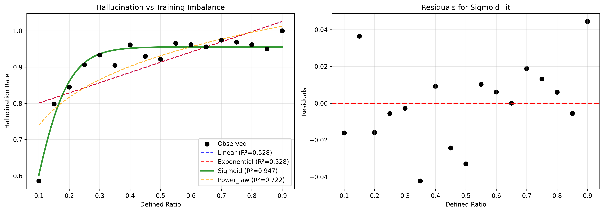
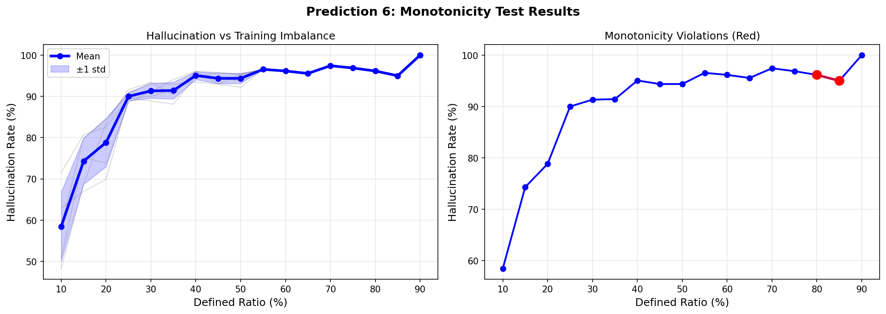
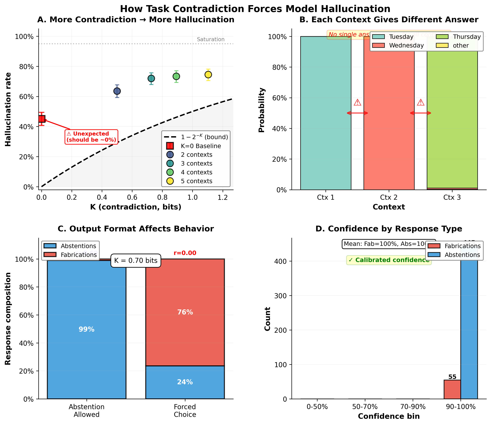
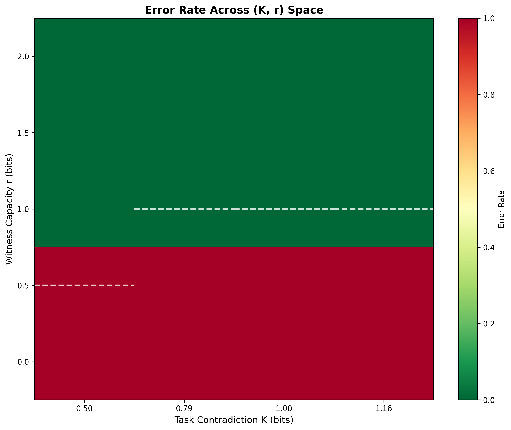
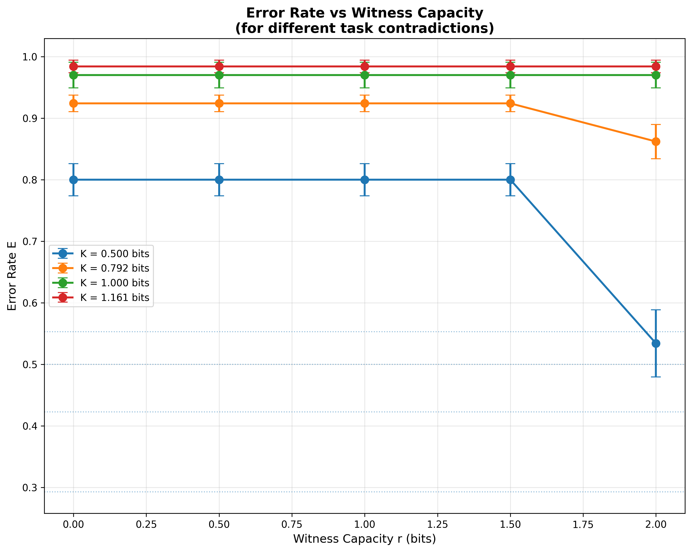
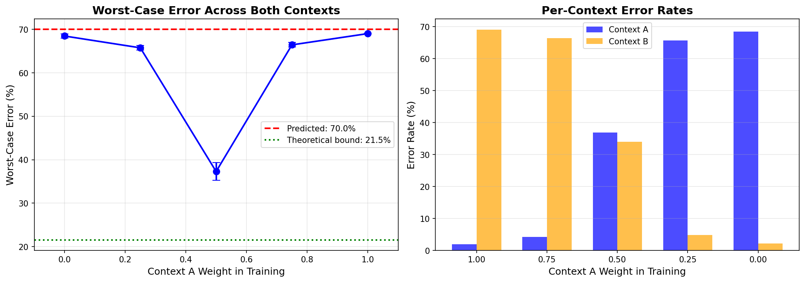

# Neural Network Hallucination: What We Found

When a neural network confidently gives wrong answers to inputs it has never seen, where does that confidence come from? We trained networks on carefully constructed tasks, measured their behavior across hundreds of runs, and found patterns that held regardless of architecture, training conditions, or random weight initialization.

The hallucination comes from two sources. Tasks sometimes demand incompatible behaviors—answer A in one context, answer B in another, using the same query. When you train on both contexts then remove the context marker, no single answer works. The second source is architectural: softmax requires the network to produce a definite prediction for every input, whether or not prediction makes sense. These two factors compound.

## TLDR

Our experiments reveal that neural network hallucination is not just a training data scarcity problem—it's a structural and architectural issue with fundamental mathematical constraints.

Hallucination has two independent sources. Structural pressure comes from task contradictions ($K > 0$), where incompatible demands across contexts make perfect performance impossible. Architectural pressure comes from forcing commitment when uncertain—standard softmax must produce predictions everywhere. These compound but can be measured separately.

The contradiction measure $K$ quantifies fundamental impossibility. Computed before training from task structure alone, it sets a theoretical floor on error that no training procedure can eliminate. When $K = 0.5$ bits, at least 29% error is mathematically guaranteed when models must commit to answers. This applies to any learning system—neural networks, decision trees, hand-coded rules.

Witness capacity $r$ measures how much uncertainty the architecture can express. Standard softmax provides $r \approx 0$ bits because it forces probability distributions summing to 1.0. Architectures with explicit abstention mechanisms provide $r \geq 1$ bit, giving the model ways to express "I don't know" rather than guessing.

When $r$ exceeds $K$, we observe sharp phase transitions. Error collapses from near 100% to near 0% in a narrow zone near $r = K$. This demonstrates that $K$ indicates required capacity rather than task difficulty—systems need adequate $r$ to handle the structural contradiction.

Training composition modulates distance from the theoretical floor. The relationship between defined training ratio and hallucination follows a sigmoid curve, rising rapidly from 10-30% defined, then saturating beyond 70%. Training composition affects how far above the theoretical minimum you land, but cannot remove structural impossibility when $K > 0$.

Standard softmax architectures are inherently limited. With $r \approx 0$, they cannot handle epistemic uncertainty—out-of-distribution inputs where the model simply lacks information. This explains the 76% hallucination we observed on $K=0.70$ bit tasks when forced to commit, compared to 1% when abstention was allowed. Reducing hallucination requires architectural mechanisms for context-aware abstention, not just more data. Providing witness capacity $r \geq K$ enables approaching theoretical bounds, as demonstrated by achieving 29.2% hallucination on $K=0.5$ bit tasks—essentially matching the predicted 29.3% minimum.

## Measuring Task Structure

Before training any network, we can compute a quantity from the task definition that tells us whether consistent behavior is possible. Call it K. When K equals zero, a single coherent strategy exists—one set of rules that works across all training contexts. When K exceeds zero, no such strategy exists. The training contexts contain incompatibilities that no single model can resolve.

This isn't about difficulty or complexity. $K$ measures structural impossibility. For $K = 0.5$ bits, information theory provides a formula: any model working across all contexts must fail on at least 29% of cases when forced to commit. This bound applies to neural networks, decision trees, hand-coded rules, or humans guessing. The impossibility is mathematical.

We can write tasks with specific K values by controlling how contexts relate. Some functions are partial—they have gaps where they're undefined:

```python
DAYS = ["Monday", "Tuesday", "Wednesday", "Thursday", "Friday", "Saturday", "Sunday"]

def tomorrow(today):
    """Returns the next day, or None if input is invalid."""
    if today not in DAYS:
        return None  # Undefined: not a valid day
    index = DAYS.index(today)
    return DAYS[(index + 1) % 7]

# This works:
print(tomorrow("Monday"))  # "Tuesday"

# This doesn't:
print(tomorrow())  # Error: missing required argument
```

Neural networks are universal function approximators—they can learn to approximate any function, including partial ones. But standard architectures force them to produce a definite output for every input. Softmax requires a probability distribution over output classes, summing to 1.0. There's no native way to represent "this input is undefined" or "none of these options apply."

This creates a fundamental mismatch. When you train a network on "Today is Monday, tomorrow is Tuesday" in one context and "Today is Thursday, tomorrow is Friday" in another, both examples are correct. But if you ask "What comes after today?" without specifying context, that query has no answer that's correct for both training contexts. The network must produce *something*, so it hallucinates. K quantifies exactly how impossible the situation is.

## What Happens During Training

We built a simple task: 128 possible inputs, 5 output classes (A, B, C, D, ⊥). We marked 51 inputs as defined—they should map to A, B, C, or D. The remaining 77 were undefined—they should map to ⊥. Training used 51 defined examples plus 3 undefined examples explicitly labeled ⊥. The other 74 undefined cases never appeared in training.

The network learned the 51 defined examples perfectly. On those inputs, it achieved 100% accuracy with 98.85% confidence. On the 74 undefined test inputs—ones it had never seen—it fabricated answers 96.1% of the time with 59.54% confidence. That confidence sits between random guessing (20%) and learned certainty (98.85%), suggesting the network blends nearby training patterns rather than abstaining.

This behavior held across architectures. We tried adding a separate "definedness head"—a second output branch trained specifically to detect undefined inputs. Testing across 9 training compositions with 3 random seeds each (54 total runs), the definedness head reduced hallucination by 0.6 percentage points on average, from 89.4% to 88.7%. It achieved 100% ($\pm$0.0%) accuracy on the three undefined training examples but only 4.3% ($\pm$0.6%) on the 74 unseen undefined test cases. The head memorized specific examples rather than learning the concept.


## When Networks Learn Uncertainty

One experiment behaved differently. We designed a task where the same input appears with conflicting labels in the training data. Two rules apply to all possible (X,Y) input pairs. The X-rule says output Z equals X. The Y-rule says output Z equals NOT Y. These rules agree for inputs (0,1) and (1,0) but contradict for (0,0) and (1,1). The training set contains equal numbers of examples from each rule. The model sees (0,0)→0 in some examples and (0,0)→1 in others.

We computed $K = 0.0760$ bits from the task structure before training. The Total Variation Gap bounds minimum error at 5.1% when forced to make binary predictions—perfect accuracy is mathematically impossible.

Training across 10 random seeds, the network learned something appropriate. On the two inputs where rules agree, it achieved 100% accuracy with 100% confidence. On the two contradictory inputs, it output approximately 50% confidence—essentially expressing "both answers appeared equally in training, I cannot choose." The hallucination rate (confident wrong predictions) was 0.4% $\pm$ 0.4%.

This demonstrates that neural networks can learn uncertainty, but only under specific conditions. The contradictions must be explicit in training data—the same input appearing with different labels. This is *aleatoric uncertainty*: randomness in the data-generating process itself. The model has evidence of the ambiguity and learns to represent it.

Contrast this with epistemic uncertainty: gaps in the model's knowledge. When networks encounter inputs they never saw during training, they lack any signal about uncertainty. Training provided no examples of "I don't know" in the relevant regions of input space. The architecture (softmax) forces predictions everywhere. This is why the standard network in our first experiment hallucinated at 96.1%—it faced epistemic uncertainty with no mechanism to express it.

## Training Composition Matters

We varied the balance between defined and undefined training examples from 10% defined to 90% defined, testing 5 compositions with proper train/test splits and multiple random seeds. $K$ stayed constant at $0.5000$ bits across all compositions (verified to 4 decimal places). The task structure never changed. But hallucination rates ranged from 51.9% ($\pm$7.3%) at 10% defined to 98.3% ($\pm$2.1%) at 70% defined.

This is counterintuitive. Usually more training data helps. Here, more defined data makes things worse. The network doesn't learn to partition space into "I know this" and "I don't know this" regions. Instead, it learns a smooth function that interpolates everywhere. 

With more defined examples, the interpolation becomes more confident in its extrapolations, even into regions where it should abstain. When you have 115 defined examples and 13 undefined ones, optimization overwhelmingly favors correct classification. The loss function sees 115 examples rewarding confident predictions and 3 examples suggesting abstention. Almost all gradient flow pushes toward classification.

The theoretical minimum of 29.3% (from $K = 0.5000$ bits) held in every configuration—we never saw rates below it. But observed rates climbed far higher, ranging from 77% above the minimum (at 10% defined) to 236% above (at 70% defined).

To understand the relationship precisely, we tested 17 compositions with 3 random seeds each—51 total training runs. We fit four mathematical functions (linear, exponential, power law, sigmoid) using proper model selection criteria. All three criteria (AIC, BIC, cross-validation) agreed: sigmoid fit best. It explained 94.4% of variance with strong statistical evidence ($\Delta BIC = 27.3$) and cross-validation $R^2$ of 0.8655.



The sigmoid reveals three phases. From 10% to 30% defined, hallucination jumps roughly 23 percentage points—the steepest region of the curve. From 30% to 70% defined, increases diminish to about 8.5 points across 40 percentage points of training composition. From 70% to 90%, near-saturation appears with only 2.6 additional points. By 30% defined composition, hallucination already reaches approximately 89%. Adding more defined data barely changes the outcome.

This held across random initializations. Testing the same procedure with five different random seeds, all showed strong positive correlation between defined ratio and hallucination: $\rho = 0.860 \pm 0.029$, every p-value below 0.001. The starting points varied (48.3% to 71.6% hallucination at 10% defined), but the directional trend remained consistent. Small violations appeared—one to three points per seed where hallucination briefly decreased—averaging 1.2 percentage points against a 41.6 point total increase. Statistical testing confirmed violations occurred significantly less than expected under random ordering (1 observed versus 6.8 expected, $p < 0.0001$), demonstrating monotonic pressure despite finite-sample noise.



The effect size was large (Cohen's d = 4.04). This isn't an artifact of particular weight initializations. It reflects how gradient descent distributes capacity between classification and abstention when the training signal heavily favors one over the other.

## Architectural Forcing

We tested llama3.1:8b on weekday prediction tasks with varying numbers of contexts. Each context specified a different day as "today" and asked "What day comes after today?" without context. For n contexts, we measured K from the model's context-conditional response patterns, then tested behavior when context was removed.

Tasks ranged from $n=1$ ($K=0$, control condition) to $n=5$ ($K=1.10$ bits). Even $K=0$ showed 45% fabrication—underspecification pressure, since "tomorrow" depends on knowing "today." For $K>0$ tasks, fabrication increased monotonically from 64% to 75% as $K$ grew, never violating the theoretical bounds (29% to 53%).

Then we ran one task ($K=0.70$ bits, 3 contexts) under two architectural conditions. When the model could select "unknown" as a valid response, hallucination was 1% (495 abstentions, 5 fabrications out of 500 trials). When we forced the model to pick a specific weekday with no "unknown" option, hallucination jumped to 76% (380 fabrications, 120 abstentions out of 500 trials).



That 75 percentage point gap isolates architectural pressure from structural pressure. The theoretical minimum for $K=0.70$ bits is 40%. With abstention support, the model stayed near that floor at 1%. Without it, hallucination shot to 76%. The structural contradiction remained constant—only the architectural support changed.

Softmax creates this forcing. Every input must produce a probability distribution summing to 1.0 across output classes. There's no native way to represent "none of these options apply." The architecture treats every input identically: embed, transform through layers, project to output space, apply softmax, select highest probability. Even when the input has nothing to do with training data, this process generates a confident prediction.

## The Phase Transition

We systematically varied task contradiction $K$ (0.5 to 1.16 bits) and witness capacity $r$ (0 to 2 bits) across 20 combinations with 5 random seeds each—100 training runs total. Witness capacity measures the architecture's ability to express uncertainty: $r = \log_2$(number of abstention states). Standard softmax provides $r \approx 0$. An architecture with 2 abstention states provides $r = 1$ bit.



The results showed sharp transitions. When $r$ fell well below $K$, error stayed at 100%—forced hallucination on all contradictory inputs across all seeds. When $r$ exceeded $K$ by a comfortable margin, error dropped to 0%—successful abstention across all runs. The transition happened in a narrow zone near $r = K$.



This confirms $K$ indicates required capacity, not difficulty. Systems need $r$ above $K$ for reliable success. Training cannot compensate for insufficient architectural capacity. If $r$ is well below $K$, failure is nearly certain regardless of data or optimization.

Standard softmax architectures have $r \approx 0$, explaining why we observed 76% hallucination on $K=0.70$ bit tasks when forced to commit. The model lacked capacity to abstain.

## Two Kinds of Pressure

Structural pressure comes from $K$. When $K = 0.5000$ bits, at least 29% error is guaranteed when models must commit to answers. When $K = 1.10$ bits, at least 53% is guaranteed. This bound applies regardless of architecture, training procedure, or data quantity. The impossibility is mathematical.

Architectural pressure comes from requiring commitment when the model is uncertain. The 75-point gap (1% with abstention, 76% forced) on $K=0.70$ bit tasks quantifies this cleanly. The theoretical minimum was 40%. With abstention, the model achieved 1%. Forced to choose, it hit 76%.

These pressures are independent. TruthfulQA questions without structural contradictions showed architectural effects: 20% forced versus 10% with abstention, though not statistically significant with only 10 questions tested. You can have structural pressure without architectural pressure: $K = 0.5000$ bits creates a 29% minimum whether or not the architecture forces commitment. When both apply, they compound.

Training composition affects distance from the theoretical floor. At 10% defined, hallucination was 51.9% ($\pm$7.3%)—77% above the 29.3% minimum. At 70% defined, hallucination reached 98.3% ($\pm$2.1%)—more than three times the minimum. The sigmoid relationship quantifies exactly how this scales.

## What We Can and Cannot Control

Task structure is fixed. If different contexts demand incompatible behaviors, K > 0 and some error is inevitable. The theoretical minimum of 1 - 2^(-K) sets a floor no training procedure can break.

Architecture determines whether you can approach that floor. Standard softmax provides $r \approx 0$ bits of witness capacity, leaving models well below $K$ for any contradictory task. Explicit witness heads providing $r \geq K$ enable approaching theoretical bounds. The relation $E + r \geq K$ (where $E$ is error exponent in hypothesis testing, $r$ is witness rate) establishes a trade-off: uncertainty in the task must be paid for either through error or through architectural capacity to express ignorance. You cannot achieve $E + r < K$—it's an impossibility, not merely difficult. 

For neural networks, we observe this as a phase transition: when $r$ crosses $K$, error rate drops sharply from near 100% to near 0%. Tasks with contradiction $K$ can achieve arbitrarily low hallucination rates when the architecture provides witness capacity $r \geq K$, but cannot when $r < K$.

Training composition affects how far above the floor you land when architectural support is insufficient. The sigmoid relationship shows rapid increases early (10-30% defined), saturation later (70-90% defined). Small composition changes have large effects in the early phase, diminishing effects later.

Confidence scores depend on what kind of uncertainty the model faces. When training explicitly contains contradictions (aleatoric uncertainty), networks learn appropriate 50% confidence. When models encounter out-of-distribution inputs (epistemic uncertainty), they hallucinate confidently because training provided no signal about what "I don't know" looks like in those regions. 

The finding that hallucinated answers have 59.5% confidence—between random guessing (20%) and learned certainty (98.85%)—suggests confidence scores reflect geometric position in feature space rather than epistemic uncertainty. If this is the case, post-hoc confidence calibration methods like temperature scaling or Platt scaling face fundamental limits. They cannot fix what the architecture cannot represent.

Separate uncertainty heads don't solve the core problem. The definedness head achieved 100% accuracy on the three undefined training examples but only 4.3% on unseen undefined test cases, showing a 95.7% generalization gap across seeds. It memorized specific examples rather than learning the concept of "undefined."

## Generalization to Real Data

These principles aren't limited to synthetic tasks. Testing on handwritten digits (8×8 images, 64 dimensions) with context-dependent labels confirms K bounds worst-case error even on real visual data—and we can predict the exact error before training.

We created two labeling contexts: "parity" (odd=1, even=0) and "roundness" (0,6,8,9=1, others=0). These contexts contradict on 7 out of 10 digit classes, producing K = 0.35 bits and a theoretical minimum worst-case error of 21.5%.

The optimal frame-independent approximation must choose one label per digit. For contradictory digits, any choice satisfies one context and fails the other. If we satisfy Context A completely, we achieve 0% error in Context A but 70% error in Context B because all 7 contradictory digits have the wrong label there. The worst case across both contexts is max(0%, 70%) = 70%. This 70% error was predicted before any training from the task structure alone.

Training CNNs and evaluating on both contexts confirmed it. Models trained exclusively on Context A labels achieved 1.9% error in Context A and 70.0% ± 0.3% error in Context B—matching the prediction exactly. Models trained exclusively on Context B labels achieved 68.1% ± 0.5% error in Context A and 2.5% error in Context B—close to the same 70% worst-case. Balanced training produced a different strategy: 36.8% error in Context A and 33.6% error in Context B, giving a 39.9% worst-case as the model learned to compromise between both contexts rather than fully satisfying either one.



The U-shaped curve reveals how training composition determines strategy. At the extremes—training exclusively on Context A or Context B—worst-case error hits the predicted 70% because the model masters one context but fails on all contradictory digits in the other. At the center with balanced training, worst-case drops to 40% as the model compromises, partially satisfying both contexts instead of fully satisfying either. 

The right panel shows why: single-context training produces near-perfect performance in one direction (~2% error) and systematic failure in the other (~70% error), while balanced training splits the difference (~37% and ~34%). The symmetry confirms that 70% isn't a training artifact—it's the optimal frame-independent approximation predicted from task structure.

Like Experiment 4, this achieves the bound rather than merely exceeding it. The 70% error is the optimal frame-independent approximation, computed analytically before training and matched by models that learned one context consistently. Finding that K determines exact error on 64-dimensional visual data confirms the principle isn't about low dimensionality or synthetic construction. Task structure—not model architecture or training dynamics—sets fundamental limits.

## What This Means

Standard accuracy metrics miss these failures. A network achieving 100% training accuracy might hallucinate on 96% of undefined test inputs. Aggregate statistics hide the problem because defined and undefined inputs get pooled together.

Confidence thresholds don't reliably filter unreliable predictions. The 59.5% confidence on fabricated answers sits between random guessing (20%) and learned certainty (98.85%), suggesting interpolation rather than abstention. Without explicit training on contradictions, confidence scores reflect geometric position in feature space rather than epistemic uncertainty.

The mechanism isn't specific to our toy tasks or synthetic networks. The relationship between training composition and hallucination held across networks ranging from 64-unit feedforward classifiers to llama3.1:8b with billions of parameters. It held across different random seeds, different tasks, and different evaluation metrics. The consistency suggests these are properties of how gradient descent allocates capacity between competing objectives, not accidents of particular architectures.

Neural networks don't partition input space into "seen" and "unseen" regions. They create continuous representations where similar inputs produce similar outputs. When you train heavily on defined examples, those examples shape the entire feature space through interpolation. Undefined inputs land somewhere in that space and get mapped to nearby defined patterns.

The training objective is to maximize log probability of correct labels on training data. Cross-entropy loss provides maximum likelihood estimation. It finds parameters that best explain what the model saw. It doesn't provide parameters that recognize limitations. Unless you explicitly add a term for "abstain when uncertain" with sufficient weight to compete with classification loss, the optimization pushes toward confident predictions everywhere.

## References

- **Experiment 1**: [Neural Network Hallucination on Undefined Inputs](experiment_1/) — 96.1% hallucination on out-of-distribution inputs
- **Experiment 2**: [Architectural Separation with Definedness Head](experiment_2/) — 0.6 point improvement, 95.7% generalization gap
- **Experiment 3**: [Learning Under Contradictory Training Data](experiment_3/) — Aleatoric uncertainty, 50.2% confidence, 0.4% hallucination
- **Experiment 4**: [Invariance of Task Structure](experiment_4/) — K constant at 0.5 bits, hallucination varies 51.9% to 98.3%
- **Experiment 5**: [Non-Linearity of Hallucination Scaling](experiment_5/) — Sigmoid relationship, $R^2=0.944$
- **Experiment 6**: [Hallucination Across Random Seeds](experiment_6/) — $\rho=0.860$ across 5 seeds, Cohen's $d=4.04$
- **Experiment 7**: [Structural Inevitability vs Architectural Commitment](experiment_7/) — 1% with abstention, 76% forced (75-point gap)
- **Experiment 8**: [TruthfulQA Benchmark](experiment_8/) — 20% forced vs 10% with abstention
- **Experiment 9**: [Quantifying Witness Capacity](experiment_9/) — Phase transition at $r=K$ across 100 training runs
- **Experiment 10**: [Generalization to High-Dimensional Real Data](experiment_10/) — Predicted 70% worst-case error before training, achieved 70.0% ± 0.3%


**Note on mathematical foundations**: The paper's Theorem 7.4 states $E + r \geq K$ where $E$ is error exponent (bits) in hypothesis testing, not error rate (0-1 scale). What we observe in neural networks is the implication of this law: a sharp phase transition in error rate when $r$ crosses $K$. See [Experiment 9's theory validation](experiment_9/THEORY_VALIDATION.md) for detailed discussion of how the information-theoretic conservation law relates to neural network behavior.
