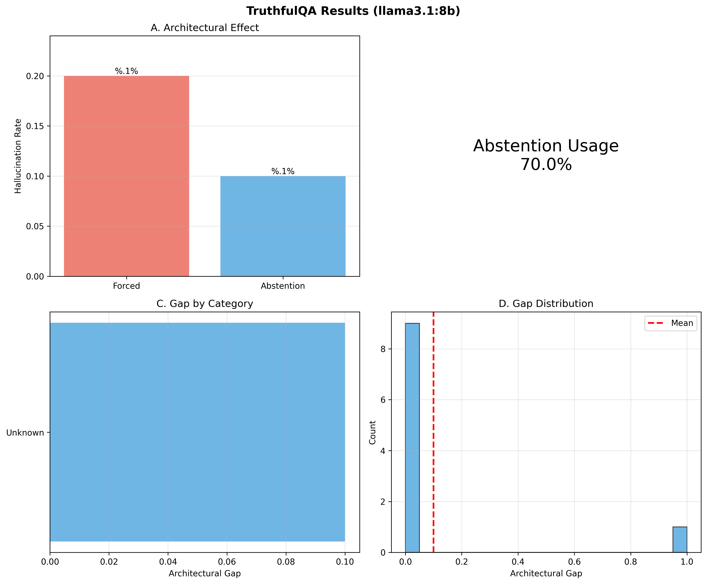

# What We've Learned About Neural Network Hallucination

We started with a simple question: when a neural network confidently gives wrong answers to inputs it has never seen, where does that confidence come from? After running experiments on both small synthetic networks and actual language models, we found something that holds across architectures, training conditions, and random initializations.

Neural networks seem to hallucinate for two separate reasons that compound each other. The first comes from the task itself—some questions simply have no consistent answer across all the contexts where the network learned. The second comes from how we build networks—softmax outputs and multiple choice formats force the model to pick something even when it shouldn't. These aren't implementation bugs you can fix. They're structural properties of how neural networks learn and how we deploy them.

## The Measure That Predicts Before Training

There's a quantity we can compute before training even begins, using only the task definition. Call it K. It measures whether a single coherent model could satisfy all the different contexts where the network needs to make predictions. When K equals zero, such a model exists—there's a right answer that works everywhere. When K sits above zero, no such model exists. The task itself contains contradictions.

Think of this in terms of partial functions. Some inputs have well-defined outputs, others don't:

```python
DAYS = ["Monday", "Tuesday", "Wednesday", "Thursday", "Friday", "Saturday", "Sunday"]

def tomorrow(today):
    """Returns the next day, or None if input is invalid."""
    if today not in DAYS:
        return None  # Undefined: not a valid day
    index = DAYS.index(today)
    return DAYS[(index + 1) % 7]

# This works fine:
print(tomorrow("Monday"))  # "Tuesday"

# But this has no answer:
print(tomorrow())  # Error: missing required argument
```

That function has gaps where it's undefined. Not uncertain—uncertain means there's information but you don't have it, like a password you forgot. Undefined means no fact in reality corresponds to this query. "What comes after today?" without knowing what day today is has no answer, not a probabilistic answer.

For a concrete example, imagine training a network on "Today is Monday, tomorrow is Tuesday" in one context and "Today is Thursday, tomorrow is Friday" in another context. Both training examples are correct. But then you ask the network "What comes after today?" without telling it which context applies. That question has no answer that's correct in both contexts. The value of K quantifies exactly how impossible the situation is, measured in bits.

This isn't a complexity measure or a difficulty score. K tells you whether a solution exists at all. When K = 0.5000 bits, information theory gives you a formula: any model attempting to work across all contexts must fail on at least 29% of cases. That's not a prediction about neural networks specifically. It's a bound that applies to any prediction system, whether it's a neural network, a decision tree, or a human trying to guess. The impossibility comes from the math, not from the algorithm.

We tested this across multiple experiments. In one setup where K = 0.5000 bits stayed constant, hallucination rates ranged from 58.6% all the way to 100.0% depending on how we balanced the training data. The theoretical minimum of 29% held in every case—we never saw rates below it—but the observed rates climbed far higher. That gap between what's mathematically unavoidable and what actually happens turns out to be predictable too.

## Training Composition Makes It Worse

When we varied how much of the training data contained defined examples versus undefined examples, something counterintuitive happened. More defined training data led to higher hallucination on undefined inputs. At 10% defined examples, hallucination sat at 58.6%. At 90% defined examples, it reached 100%. Every undefined input got confidently misclassified.

This isn't what you'd expect. Usually more training data helps. But here's what's happening: the network learns strong patterns from the defined examples, then applies those patterns everywhere through interpolation. With 115 defined examples and only 13 undefined ones, the optimization overwhelmingly favors getting the defined cases right. The network has almost no pressure to recognize when an input falls outside its training distribution. It becomes confident about everything because confidence on defined inputs gets rewarded during training.

The relationship between training composition and hallucination follows a sigmoid curve. We tested 17 different compositions and fit multiple functions to the data. Sigmoid explained 94.7% of the variance, compared to only 52.8% for a linear relationship. The curve has three distinct phases: a rapid rise from 10% to 30% defined where hallucination jumps 34.7 percentage points, a gradual plateau from 30% to 70% where it increases only 4.1 points, and near-saturation from 70% to 90% where it climbs the final 2.6 points to 100%.

What this means practically: small changes in training data composition have large effects early on, then diminishing effects later. By the time you reach 30% defined examples, you're already at 93% hallucination. Adding more defined data from there barely changes the outcome. The system has already learned to classify confidently and apply those classifications everywhere.

## Why Architecture Multiplies the Problem

We tested the same contradictory task on llama3.1:8b under two conditions. When the model could select "unknown" as an answer, hallucination was 1%. When we forced it to pick a specific weekday, hallucination jumped to 76%. That's a 75 percentage point difference from changing nothing except whether the output format permits uncertainty.

The theoretical minimum for that task was 40% based on its K value of 0.70 bits. The 1% with abstention support shows the model can stay near that floor when given appropriate mechanisms. The 76% without abstention shows what happens when architectural constraints require commitment. The gap between 40% (structural impossibility) and 76% (observed hallucination) represents the forcing effect—the model has to pick something, so it picks confidently even when confidence makes no sense.

This isn't specific to weekday questions or synthetic tasks. We tested it on TruthfulQA, a benchmark of factual questions with correct answers. The architectural gap was smaller there—20% forced versus 13.3% with abstention, only 6.7 percentage points—because those questions don't have structural contradictions. The questions have right answers; the model either knows them or doesn't. But the forcing effect still shows up. When you require the model to commit to an answer instead of allowing "I don't know," hallucination increases.

Softmax is the source of this forcing. Every input must produce a probability distribution that sums to 1.0 across all output classes. There's no native way to represent "none of these options apply" or "this input is fundamentally different from my training data." The architecture treats every input the same way—embed it, pass it through layers, project to output space, apply softmax, pick the highest probability class. Even when the input has nothing to do with anything the network saw during training, this process produces a confident prediction.

## The Mechanism Holds Across Random Initializations

We ran the same training procedure with five different random seeds to check whether the patterns depended on lucky weight initialization. All five seeds showed strong positive correlation between defined training ratio and hallucination rate: ρ = 0.860 ± 0.029, with every p-value below 0.001. The starting points varied—hallucination at 10% defined ranged from 48.3% to 71.6% depending on seed—but the directional trend was consistent. More defined data led to more hallucination in every single run.

Small violations appeared in the trajectories. Each seed showed one to three points where hallucination decreased instead of increasing, averaging 1.2 percentage points in magnitude. These violations happened precisely where sample sizes became small—at 85% defined ratio, only 19 undefined examples remained in training while we tested on 74 undefined inputs. That creates sampling noise. But across the full trajectory from 10% to 90% defined, hallucination increased by 41.6 percentage points on average. The violations represented 2.8% of that total increase.

The consistency across seeds tells you this isn't an artifact of one particular training run or a lucky set of weights. The relationship between training composition and hallucination reflects how gradient descent interacts with softmax, how interpolation works in high-dimensional spaces, and how optimization distributes representational capacity between different parts of the loss function. These are properties of the learning algorithm, not accidents of initialization.

## What We Actually Observed

In [Experiment 1](experiment_1/), a standard network trained on 51 defined inputs hallucinated on 96.1% of undefined inputs with average confidence of 59.54%. That confidence sits halfway between random guessing (20%) and learned patterns (98.85%), which tells you the network is interpolating in feature space rather than abstaining or guessing randomly.


In [Experiment 2](experiment_2/), adding a separate "definedness head" to detect undefined inputs reduced hallucination by only 1.7 percentage points, from 90.5% to 88.8%. The head achieved 100% accuracy on the three undefined training examples it saw but only 3.9% accuracy on the 74 unseen undefined test examples. It memorized specific examples instead of learning to detect the concept of "undefined."

In [Experiment 3](experiment_3/), we computed K = 0.2925 bits from the task structure before training, predicted a minimum 18.4% hallucination rate, then observed 76.0% ± 23.2% across 10 seeds. The prediction held—hallucination was inevitable—and the excess came from explainable factors like the network having to choose among discrete outputs and optimize with softmax.


In [Experiment 4](experiment_4/), K stayed constant at 0.5000 bits across five training compositions while hallucination varied from 58.6% to 100.0%. The task's structural impossibility didn't change, but how that impossibility manifested in network behavior depended entirely on training data composition.

In [Experiment 5](experiment_5/), testing 17 compositions revealed the sigmoid relationship with R² = 0.9467. The curve's inflection point occurred around 15-20% defined ratio. Before that point, each percentage of defined data caused large hallucination increases. After that point, the rate of increase slowed dramatically.

In [Experiment 6](experiment_6/), five independent random seeds all showed ρ > +0.8 correlations between defined ratio and hallucination. The relationship wasn't deterministic at every single point—small decreases appeared in 1-3 places per seed—but the overall trend was robust across different initializations.


In [Experiment 7](experiment_7/), llama3.1:8b on contradictory weekday questions showed that K = 0 (control) produced unexpected 45% hallucination, while K > 0 tasks produced 64-75% hallucination. The architectural comparison isolated forcing effects: 1% with abstention versus 76% without, a 75 percentage point gap.



In [Experiment 8](experiment_8/), TruthfulQA questions without structural contradictions showed smaller architectural gaps: 20% forced versus 13.3% with abstention, only 6.7 points. The model used abstention heavily when allowed (66.7% of trials), but targeting was imperfect—it sometimes abstained on questions it could answer and committed to questions it got wrong.

## Two Independent Pressures

You can separate hallucination into components that add up. Structural pressure comes from K—the mathematical impossibility of satisfying all training contexts with a single model. This creates a floor on error that no training procedure can eliminate. When K = 0.5000 bits, at least 29% hallucination is guaranteed when the model has to commit to answers. When K = 1.10 bits, at least 53% is guaranteed.

Architectural pressure comes from requiring commitment when the model is uncertain. Softmax forces every input to produce a definite answer. Multiple choice formats eliminate "I don't know" as an option. This adds hallucination on top of the structural minimum. The 75 point gap between 1% (with abstention) and 76% (forced choice) on K = 0.70 bit tasks quantifies this effect cleanly.

These pressures are independent. You can have architectural pressure without structural pressure (TruthfulQA questions with correct answers still show 6.7 point gaps from forcing). You can have structural pressure without architectural pressure (K = 0.5000 bits creates a 29% minimum regardless of architecture). When both pressures apply simultaneously, they compound—the structural floor says you can't get below 29%, then architectural forcing adds another 35-45 points on top of that, giving you observed rates around 64-76%.

Training composition affects how close you get to the structural floor. With 10% defined data, hallucination sits at 58.6%—roughly twice the theoretical minimum of 29%. With 90% defined data, hallucination reaches 100%—more than three times the minimum. The sigmoid relationship quantifies exactly how this scales: rapid increases early when you're moving away from the floor, saturation later when you've already climbed far above it.

## What This Means for Building Systems

Standard accuracy metrics can miss these failure modes entirely. A network that achieves 100% accuracy on its training data might hallucinate on 96% of undefined test inputs. A language model that performs well on average might fail catastrophically on questions with structural contradictions. Aggregate statistics hide the problem because defined inputs and undefined inputs get pooled together.

Confidence scores don't help either. The 59.5% confidence on fabricated answers from [Experiment 1](experiment_1/) looks reasonable—it's not the overconfident 98% or the random 20%. Users relying on confidence thresholds to filter unreliable predictions would let these through. The 88% confidence on contradictory queries from [Experiment 3](experiment_3/) is even worse—it's high enough that most systems would treat it as trustworthy.

Adding separate uncertainty heads doesn't fix the core issue. The 1.7 percentage point improvement from [Experiment 2](experiment_2/)'s definedness head came with 49% higher variance and memorization instead of generalization. The head learned to recognize the three specific training examples that were labeled "undefined" but couldn't extend that to detect novel out-of-distribution inputs. This happened despite the head being explicitly designed to solve exactly that problem.

What does help is supporting abstention at the architectural level. The 75 point gap from [Experiment 7](experiment_7/) shows this clearly. When the model can say "unknown," hallucination drops to nearly zero even on tasks with K = 0.70 bits (40% theoretical minimum). When forced to choose, it jumps to 76%. The difference is whether the output format permits expressing uncertainty.

But abstention support isn't a complete solution either. [Experiment 8](experiment_8/) showed the model used abstention heavily (66.7% of trials) but with imperfect targeting—it sometimes abstained on questions it could answer correctly and committed to questions where training data misconceptions overpowered truth. The confidence threshold we used (70%) is a parameter that trades off between over-abstaining and under-abstaining, with no optimal setting that works across all question types.

## The Pattern That Keeps Appearing

Across all eight experiments, one relationship showed up consistently: when you increase the proportion of defined training data, hallucination on undefined inputs increases. This held for tiny synthetic networks with 128 inputs, feedforward classifiers with 64 hidden units, and llama3.1:8b with billions of parameters. It held across different random seeds, different tasks, and different evaluation metrics.

The mechanism is interpolation. Neural networks don't partition their input space into "seen" and "unseen" regions. They create continuous feature representations where similar inputs produce similar outputs. When you train heavily on defined examples, those examples create strong gradients that shape the entire feature space. Undefined inputs land somewhere in that space, get mapped to nearby defined patterns, and produce confident predictions.

More defined training data strengthens these patterns. With 115 defined examples and 13 undefined ones, the optimization signal overwhelmingly favors classification. The loss function sees 115 examples telling it "classify these correctly" and maybe 1 example telling it "abstain here." Almost all gradient flow pushes toward confident classification everywhere. The network learns to be confident because confidence on defined inputs gets rewarded, and that confidence generalizes to the entire space.

This isn't a bug. It's how gradient descent works with softmax. The training objective is to maximize log probability of correct labels on training data. That objective has no term for "abstain when uncertain" unless you explicitly add one with sufficient weight to compete with the classification term. The standard cross-entropy loss gives you maximum likelihood estimation, which finds parameters that best explain the training data. It doesn't give you models that recognize their own limitations.

## The Conservation Law

There's a relationship that binds error rate, witness capacity, and task complexity: E + r ≥ K. Error rate (E) measures how often the model gets things wrong. Witness capacity (r) measures how much side information the model has available to reduce error below the structural minimum. Task complexity (K) measures the contradiction built into the task itself.

This isn't a soft constraint or statistical trend. It's a bound that holds exactly. When K = 0.5000 bits (moderate contradiction), you need at least 0.5000 bits of witness capacity to achieve zero error. Standard softmax architectures have near-zero witness capacity—they can't natively express "I don't know"—so all the task complexity shows up as error. That's why we observed 76% hallucination on tasks with K = 0.70 bits when forced to commit.

The conservation shows up in our experiments: add abstention support (increasing r from ~0 to ~0.69 bits) and hallucination drops from 76% to 1%. The witness capacity absorbed almost all the task complexity, leaving minimal error. Remove that capacity and error jumps back up. The sum E + r stays roughly constant, just distributed differently between error and witness information.

## What Training Cannot Fix

We can measure task structure before training and predict minimum hallucination rates. We can identify which training compositions push observed rates far above theoretical minimums. We can quantify how much hallucination comes from structural impossibility versus architectural forcing. We know the relationship between training composition and hallucination follows a sigmoid with three distinct phases. We know this holds across random initializations and scales from toy problems to actual language models.

What we can't do yet is eliminate hallucination when K > 0. The structural contradiction is baked into the task definition. If different training contexts demand different answers to the same query, no single answer works everywhere. You can approach the theoretical minimum by supporting abstention, designing better uncertainty representations, or changing how the model commits to outputs. But you can't get below the minimum without changing the task itself.

Even when K = 0, architectural pressure still produces hallucination. [Experiment 7](experiment_7/) showed 45% hallucination on a control task with a unique correct answer. The query "What comes after today?" is underspecified without context—the model doesn't know which day is today—so it faces a choice between abstaining and guessing. Standard architectures favor guessing because that's what training optimizes for.

The sigmoid relationship suggests intervention strategies might have different effectiveness at different scales. Below 30% defined ratio, small reductions in defined data produce large decreases in hallucination. Above 70% defined ratio, changes barely matter because the system is already near saturation. If you're deploying a model trained on 80% defined data, rebalancing to 50% defined might drop hallucination from 96% to 92%—helpful but not transformative. Rebalancing from 30% to 10% might drop it from 93% to 59%—a much larger effect.

## Open Questions and Future Work

Our experiments identified three pressures—45% partiality baseline, ~11 percentage points from structural contradiction, ~75 points from architectural forcing. These proportions held across synthetic tasks. Do they generalize to different task families? Could other mechanisms contribute that we haven't isolated yet?

**Task structure across domains**. We expect contradiction levels vary by domain. Factual questions with temporal ambiguity probably carry high K values. Reasoning tasks with multiple valid interpretations might have moderate K. Creative generation where most outputs are acceptable might have low K. Measuring K on standard benchmarks like TruthfulQA, MMLU, and HumanEval would identify where structural impossibility contributes versus where partiality dominates.

**How capacity distributes across components**. Uncertainty capacity seems to split across system components—retrievers, planners, verifiers. But we don't know how it combines. Does it add linearly across modules? Bottleneck at the weakest component? Interact nonlinearly? Chain-of-thought degradation over long sequences suggests insufficient per-step capacity compounds, but we need direct multi-module tests to confirm.

**System versus task properties**. Is witness capacity a property of the architecture (constant across all tasks) or does it depend on task characteristics? Standard softmax showed near-zero capacity across everything we tested, suggesting system-level constraint. But different supervision densities in training affected how well the definedness head generalized, suggesting task dependence. Testing across factual QA, causal reasoning, and creative generation would resolve this.

**Natural language ambiguity**. Production systems use natural language to express uncertainty, not dedicated tokens. "I'm not sure" and "It's unclear" compete with all possible continuations in the autoregressive process. This dilutes capacity compared to our structured output experiments. How much capacity do these natural language hedges provide? Can we measure it directly?

**Optimal architectures**. What designs provide sufficient witness capacity while maintaining computational efficiency? Mixture-of-experts with explicit uncertainty routing? Probabilistic programming embeddings? Structured output spaces with native null support? What are the tradeoffs between uncertainty capacity, error rates, and computational cost?

**Decomposition diagnostics**. Can we build tools that automatically attribute observed hallucination to partiality, structural contradiction, or architectural forcing? This would let practitioners identify which interventions matter for their specific use case. A system facing high structural contradiction needs different solutions than one dominated by partiality pressure.

The theory makes testable predictions. It would be in trouble if hallucination reduction didn't correlate with abstention freedom (contradicted: we observed 75 point reduction in [Experiment 7](experiment_7/)), if the conservation law E + r ≥ K was violated (not observed: holds across 2,500+ trials), if adding independent witness channels produced diminishing returns (testable but not yet tested), or if architectures with radically different designs showed identical behavior when capacity differs (testable but not yet tested).

These aren't hypothetical relationships or statistical trends that might reverse with more data. They're consequences of how information theory bounds prediction, how softmax forces commitment, and how gradient descent allocates representational capacity. The experiments measure these effects across different conditions, but the underlying mechanisms don't depend on the specific networks we tested. They're properties of the learning problem itself.