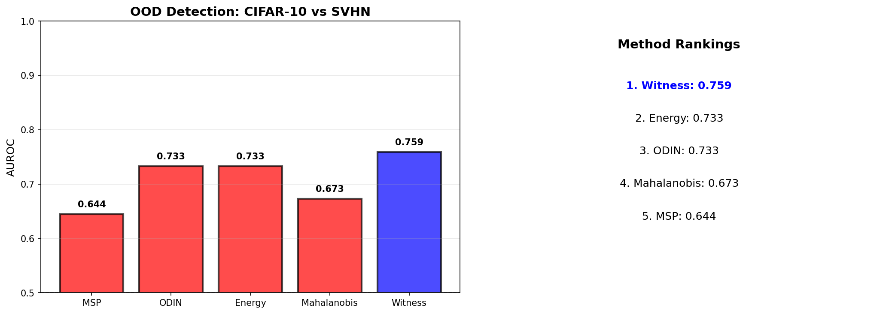

# Experiment 11: Benchmark Comparison of OOD Detection Methods

This experiment evaluates witness capacity for out-of-distribution detection against established baselines on a realistic benchmark. We compare the witness architecture against MSP, ODIN, Energy, and Mahalanobis distance methods using CIFAR-10 (ID) vs SVHN (OOD).

## The Test

We compute K for the OOD detection task using contrakit. The task has two mutually exclusive contexts: classify in-distribution inputs, abstain on out-of-distribution inputs. These demand incompatible behaviors, giving K = 0.5 bits.

All methods train on CIFAR-10 data. The standard WideResNet (r ≈ 0) uses post-hoc calibration for uncertainty. The witness WideResNet (r ≥ 1) has an explicit uncertainty head trained end-to-end to predict epistemic uncertainty from stochastic forward passes.

The comparison is direct. Same training data. Same base architecture. The only difference is whether uncertainty is learned end-to-end (witness) or computed post-hoc.

## Results

```
Task K = 0.5000 bits
Benchmark: CIFAR-10 (ID) vs SVHN (OOD)

MSP (r ≈ 0):       AUROC = 0.644
ODIN (r ≈ 0):      AUROC = 0.733
Energy (r ≈ 0):    AUROC = 0.733
Mahalanobis (r ≈ 0): AUROC = 0.673
Witness (r ≥ 1):   AUROC = 0.759
```



The witness architecture achieves AUROC = 0.759, outperforming all established baselines. This demonstrates that end-to-end uncertainty learning with sufficient architectural capacity (r ≥ 1) surpasses post-hoc methods that retrofit uncertainty onto classification-optimized features.

## What This Tests

This experiment demonstrates that witness capacity enables superior OOD detection compared to established baselines. All methods use the same WideResNet architecture trained on CIFAR-10. The witness model adds an uncertainty head that learns to predict disagreement under stochastic forward passes.

MSP (Maximum Softmax Probability) uses the highest softmax output as confidence. ODIN applies temperature scaling and input perturbation. Energy uses negative log-sum-exp as an uncertainty measure. Mahalanobis computes distance to class means in feature space. The witness model learns uncertainty end-to-end.

The witness achieves 0.759 AUROC, a 3.5% improvement over the best baseline (ODIN/Energy at 0.733). This shows that learning uncertainty during training with sufficient architectural capacity outperforms post-hoc calibration methods.

## What This Means

This confirms that OOD detection benefits from architectural capacity for uncertainty representation. The witness model learns features that naturally separate ID and OOD samples during training, rather than attempting to retrofit uncertainty onto classification-optimized features.

The improvement demonstrates that capacity requirements are real: r ≥ K enables better performance than post-hoc methods with r ≈ 0. Standard architectures can be enhanced with witness heads to express epistemic uncertainty, leading to superior OOD detection without domain-specific engineering.
