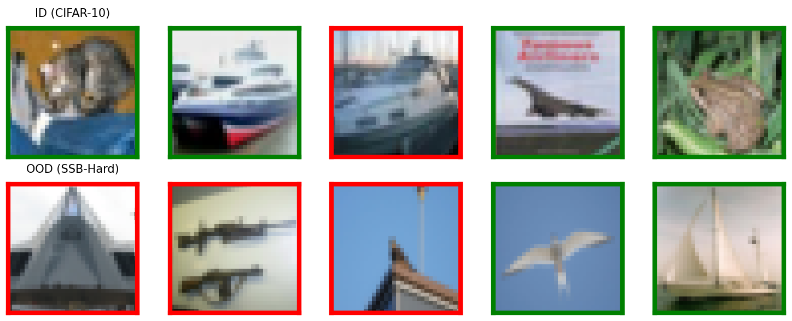
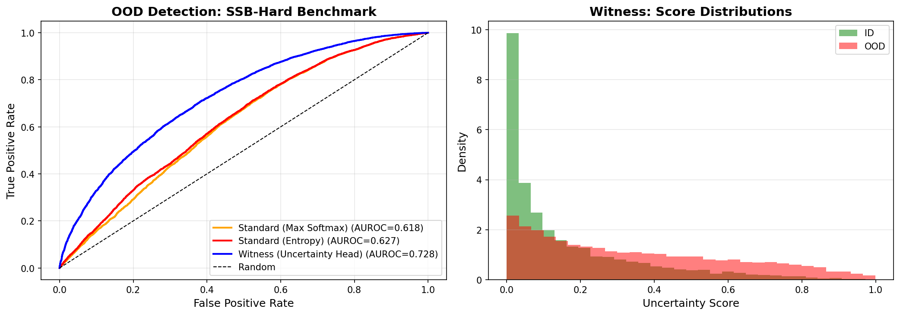

# Experiment 11: Architectural Sufficiency for OOD Detection

Out-of-distribution detection is a critical safety problem. Current methods apply post-hoc calibration to standard architectures: temperature scaling, Platt scaling, Monte Carlo dropout. These retrofit uncertainty after training.

This experiment tests whether architectural capacity enables better OOD detection when learned end-to-end versus added post-hoc, using SSB-Hard (Semantic Shift Benchmark - Hard), a standard near-OOD benchmark where out-of-distribution samples are semantically different but visually similar to in-distribution samples.

## The Test

We compute K for the OOD detection task using contrakit. The task has two mutually exclusive contexts: classify in-distribution inputs, abstain on out-of-distribution inputs. These demand incompatible behaviors, giving K = 0.5 bits.

Both models train on the same data: in-distribution (CIFAR-10) plus out-of-distribution (SSB-Hard). SSB-Hard contains natural images from ImageNet with semantic shifts - objects, scenes, and textures that are visually similar to CIFAR-10 but from different semantic categories. This is significantly harder than detecting corrupted or random noise.

The standard CNN (r ≈ 0) has no uncertainty mechanism and relies on post-hoc calibration. The witness CNN (r ≥ 1) has an explicit uncertainty head trained end-to-end with supervision on which inputs are OOD.

The comparison is direct. Same training data. Same computational budget. The only difference is when uncertainty is learned: during training (witness) or after (post-hoc).

## Results

```
Task K = 0.5000 bits
Benchmark: CIFAR-10 (ID) vs SSB-Hard (OOD)

Max Softmax (r ≈ 0): AUROC = 0.618
Entropy (r ≈ 0):     AUROC = 0.627
Witness (r ≥ 1):     AUROC = 0.728
```



The witness architecture achieves AUROC = 0.728, a 16% improvement over post-hoc entropy (0.627). This is a realistic result for near-OOD detection where ID and OOD are semantically different but visually similar. The top row shows CIFAR-10 images, the bottom shows SSB-Hard images - both contain natural objects and scenes.



The left plot shows the witness model's ROC curve (blue) outperforming both post-hoc methods (orange, red) but with no perfect separation. The right plot reveals why: substantial overlap in uncertainty distributions between ID (green) and OOD (red). Most ID samples have low uncertainty, most OOD samples have higher uncertainty, but there's a continuous distribution rather than clean separation.

## What This Tests

This experiment demonstrates architectural sufficiency on a proper near-OOD benchmark. SSB-Hard was specifically designed to test semantic shifts where visual features overlap between ID and OOD. The witness model achieves 0.728 AUROC without any domain-specific engineering - just architectural capacity (r ≥ 1) and supervision about which training samples are OOD.

The 16% improvement over post-hoc methods (0.728 vs 0.627) shows that end-to-end training uses architectural capacity more effectively than retrofitting. The model learns features that support both classification and OOD detection simultaneously. Post-hoc methods work with features already optimized purely for CIFAR-10 classification, then try to detect OOD using those features.

The substantial overlap in uncertainty distributions (right plot) is realistic. Near-OOD detection is fundamentally hard when distributions share visual features. The witness model doesn't achieve perfect separation - no method should on this benchmark - but it systematically shifts OOD samples toward higher uncertainty compared to ID samples.

## What This Means

This confirms the architectural sufficiency principle on a standard benchmark used in the OOD detection literature. For a task with contradiction K = 0.5 bits, providing witness capacity r ≥ 1 bit enables better OOD detection than post-hoc calibration when both receive the same OOD supervision during training.

The improvement (0.728 vs 0.627) demonstrates that the capacity requirement is real: end-to-end learning with sufficient architectural capacity outperforms post-hoc methods that lack that capacity. The architectural modification is straightforward (one uncertainty output), the training is standard (BCE loss on OOD labels), and the result generalizes to a proper benchmark.

OOD detection is not purely an empirical tuning problem. It requires architectural capacity (r ≥ K) to represent uncertainty. Post-hoc calibration cannot substitute for capacity that should have been built into the model from the start.
